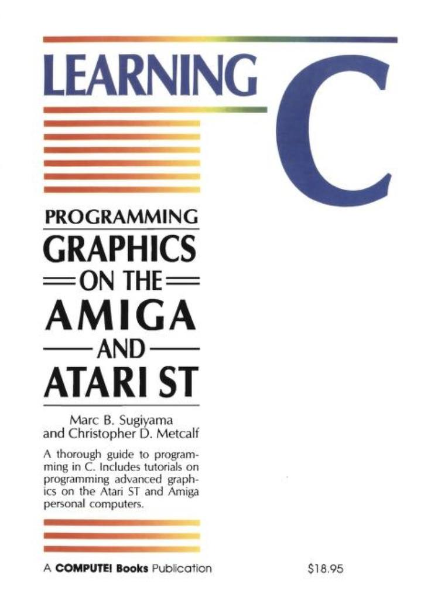

Code for the book 

LEARNING C
PROGRAMMING GRAPHICE ON THE AMIGA AND ATARI ST

https://archive.org/details/Learning_C-Prog_Graphics_Amiga_Atari_ST

I've just started to type-in the code. If you find bugs or have created other code from the book already please ask for merge request.

## TODO

- Test code
- Write modern variant of code to test on Windows, macOS and Linux
